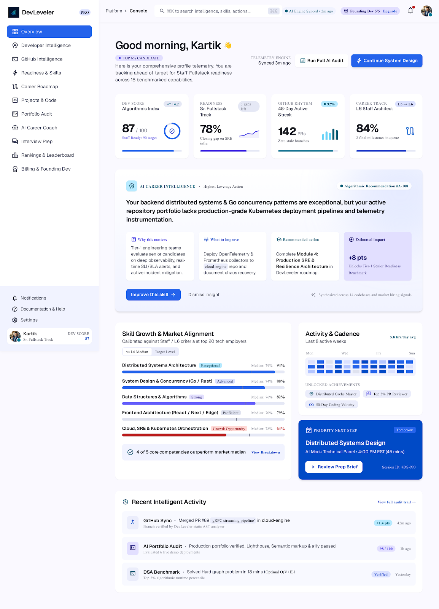
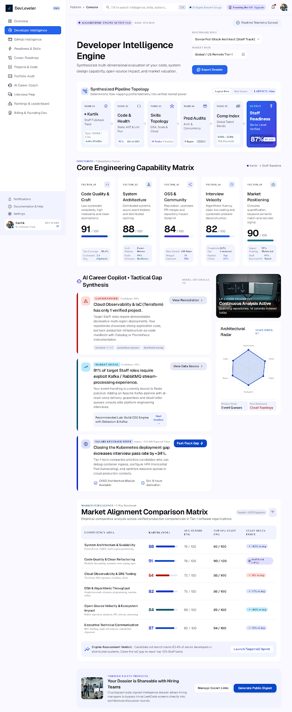
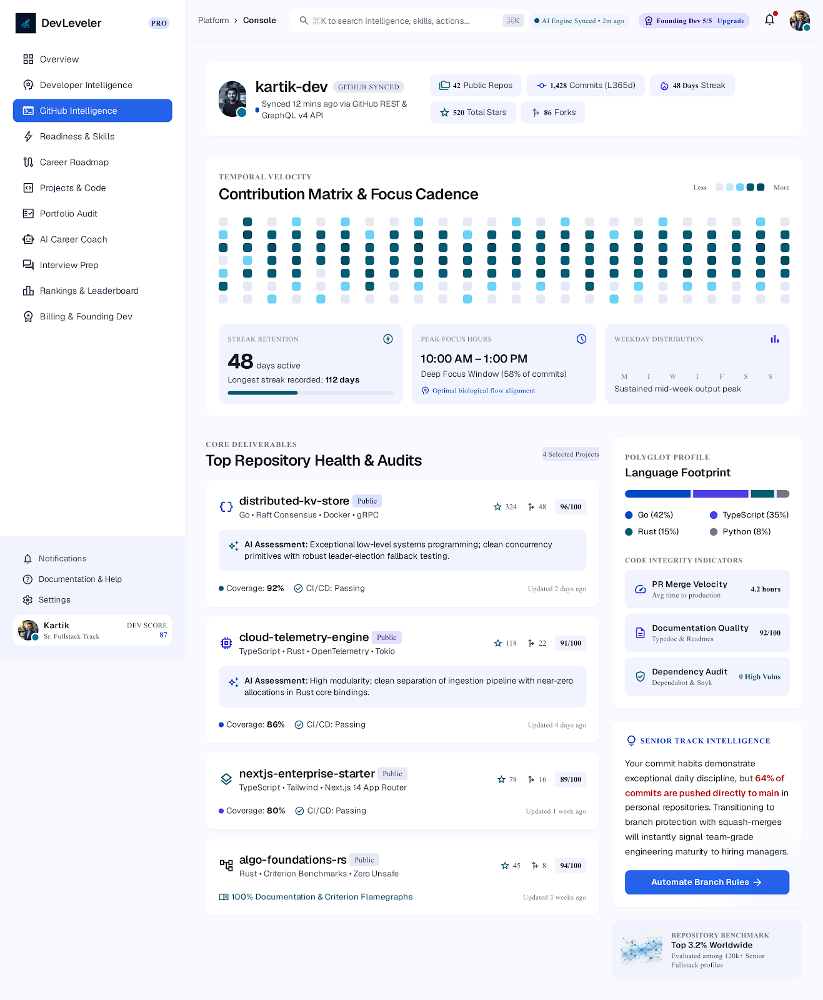
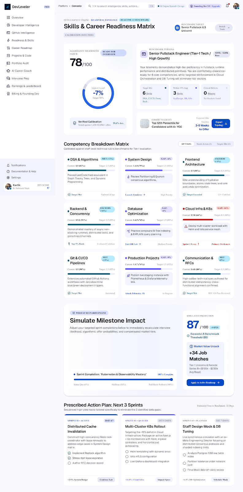
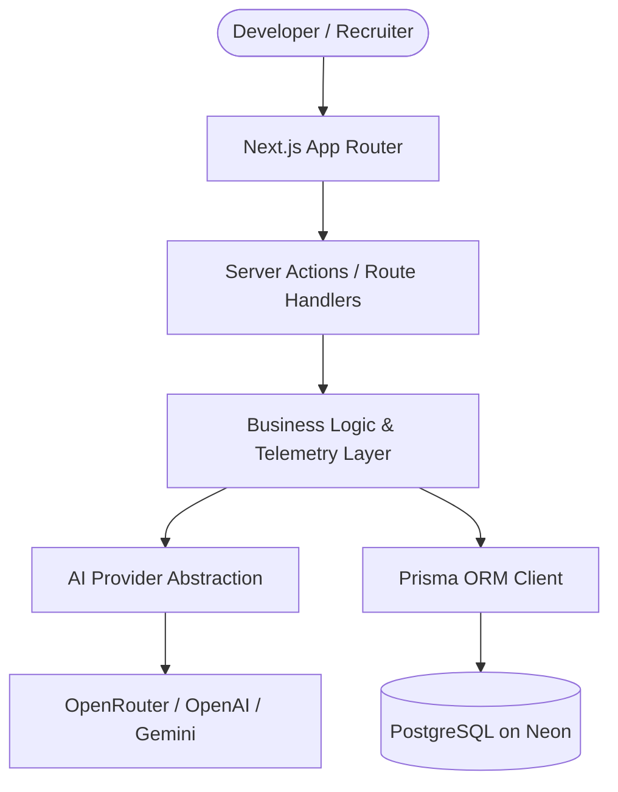

<div align="center">


# DevLeveler

### AI-powered developer growth & career intelligence platform.

DevLeveler aggregates code activity, resume data, and project telemetry into an actionable engineering profile. It benchmarks developer capabilities, identifies technical gaps, and builds customized career roadmaps.

[GitHub Repository](https://github.com/kartikshukla2301-eng/DEVLEVELER) · [Report Bug](https://github.com/kartikshukla2301-eng/DEVLEVELER/issues) · [Request Feature](https://github.com/kartikshukla2301-eng/DEVLEVELER/issues)

<br />

[](LICENSE)
[](https://nextjs.org/)
[](https://react.dev/)
[](https://www.typescriptlang.org/)
[](https://tailwindcss.com/)
[](https://www.prisma.io/)
[](https://neon.tech/)

</div>

---

## Quick Snapshot

| Property | Implementation |
|---|---|
| **Framework** | Next.js 15 (App Router, Server Actions, Turbopack) |
| **Language** | TypeScript 5 (Strict Mode) |
| **Styling** | Tailwind CSS v4 |
| **Database** | PostgreSQL via Prisma ORM (Neon Serverless) |
| **Authentication** | Auth.js / NextAuth v5 (Google, GitHub, Credentials) |
| **AI Layer** | Multi-provider architecture (OpenRouter, OpenAI, Gemini) |
| **License** | MIT License |

---

## Why DevLeveler

> DevLeveler turns a developer's GitHub activity, resume, portfolio, projects, and skills into a single engineering-growth profile.

- **Analyze real developer signals**: Scans public repositories, commit cadence, language usage, and architecture quality.
- **Identify skill & readiness gaps**: Benchmarks technical competencies against target roles from Entry-Level to Staff.
- **Generate actionable roadmaps**: Provides structured weekly milestones, suggested toolchains, and project suggestions.
- **Track growth with telemetry**: Uses XP progression, unlockable achievements, and synthesized intelligence reports.

---

## Product Preview

<p align="center">
  
  <em>Dashboard Overview — High-level telemetry, Developer Score, and real-time activity</em>
</p>

<br />

<p align="center">
  
  <em>Developer Intelligence — 6-node synthesis pipeline and 5-vector capability radar</em>
</p>

<br />

<p align="center">
  
  <em>GitHub Intelligence — Commit cadence, repository telemetry, and language distribution</em>
</p>

<br />

<p align="center">
  
  <em>Readiness & Skills — Role-targeted readiness indices, skill gaps, and roadmap sprints</em>
</p>

---

## Core Features

### Developer Intelligence
- **Developer Scoring**: Multi-metric evaluation combining code velocity, repo health, and technical breadth.
- **Skill-Gap Analysis**: Identifies missing libraries, patterns, and concepts required for target roles.
- **Role Readiness**: Quantified readiness scores across Frontend, Backend, Full-Stack, and Graduate levels.
- **Engineering Insights**: Synthesized dossier highlighting primary strengths and tactical gaps.

### Code & Project Intelligence
- **GitHub Repository Analysis**: Audits repository health, license compliance, star counts, and forks.
- **Commit & Activity Insights**: Visual velocity grid tracking contribution consistency over time.
- **Project Architecture Auditing**: Inspects documentation completeness, scalability, and code structure.
- **Language Breakdown**: Polyglot distribution analysis across all synced public repositories.

### Career Intelligence
- **AI Career Coach**: Interactive conversational advisor for guidance on career transitions and architectural decisions.
- **Career Roadmap Generator**: Tailored weekly and monthly milestones based on identified gaps.
- **Interview Preparation**: Role-focused technical, HR, and scenario questions with feedback.
- **Resume ATS Analysis**: Parses uploaded resumes for keyword gaps, structure flaws, and hiring-manager signals.
- **Portfolio Website Audit**: Evaluates personal portfolio URLs for mobile responsiveness, performance, and design clarity.

### Progress & Profiles
- **XP & Leveling System**: Earn experience points for completing analyses, syncing repos, and improving scores.
- **Achievement Badges**: Commemorates career milestones like first code audit, ATS optimization, and high GitHub scores.
- **Public Profiles (`/u/[username]`)**: Shareable developer card displaying verified scores, metrics, and top repos.
- **Admin & Recruiter Portals**: Dedicated talent discovery filtering by score and skill alongside system-wide telemetry.

---

## Tech Stack

| Layer | Stack |
|---|---|
| **Frontend** | Next.js 15, React 19, TypeScript |
| **Styling** | Tailwind CSS v4 |
| **Backend** | Next.js Server Actions & Route Handlers |
| **Database** | PostgreSQL (Neon Serverless) |
| **ORM** | Prisma v6 |
| **Authentication** | Auth.js / NextAuth v5 (OAuth & Credentials) |
| **AI Engine** | OpenRouter (default), OpenAI, and Google Gemini |
| **Schema Validation** | Zod v4 |
| **Data Visualization** | Recharts |
| **Animation** | Motion |

---

## Architecture



### Decoupled AI Layer
DevLeveler separates feature logic from AI model APIs. A unified facade (`src/lib/ai`) resolves the configured provider at runtime via `AI_PROVIDER`, allowing seamless switching between OpenRouter, OpenAI, and Gemini without modifying business actions.

---

## Project Structure

```
DevLeveler/
├── prisma/
│   ├── schema.prisma         # Relational database schema (19 models)
│   └── seed.ts               # Database seed script for development
├── public/                   # Static branding, logo, and sample assets
├── src/
│   ├── actions/              # Next.js Server Actions (score, resume, roadmap, etc.)
│   ├── app/                  # App Router pages and API routes
│   │   ├── (auth)/           # Authentication pages (login, signup, reset)
│   │   ├── (dashboard)/      # Protected dashboard routes
│   │   │   └── dashboard/    # Intelligence, GitHub, Readiness, Coach, etc.
│   │   ├── api/auth/         # NextAuth handler routes
│   │   └── u/[username]/     # Public profile route
│   ├── components/           # UI components (dashboard, landing, primitives)
│   ├── lib/                  # Shared utilities and services
│   │   ├── ai/               # AI provider abstraction & prompt caching
│   │   ├── github.ts         # GitHub API client
│   │   ├── prisma.ts         # Global Prisma client singleton
│   │   ├── rate-limit.ts     # In-memory sliding window rate limiter
│   │   └── xp.ts             # Experience points and leveling logic
│   ├── types/                # TypeScript interface and type definitions
│   ├── auth.ts               # Auth.js configuration and callbacks
│   └── middleware.ts         # Session verification and route protection
├── .env.example              # Environment variables template
├── next.config.ts            # Next.js configuration
└── package.json              # Dependencies and scripts
```

---

## Getting Started

### Prerequisites
- Node.js `20.x` or higher
- npm `10.x` or higher
- A PostgreSQL connection string (e.g. from [Neon](https://neon.tech))

### Installation

1. **Clone the repository**:
   ```bash
   git clone https://github.com/kartikshukla2301-eng/DEVLEVELER.git
   cd DEVLEVELER
   ```

2. **Install dependencies**:
   ```bash
   npm install
   ```

3. **Configure environment variables**:
   ```bash
   cp .env.example .env.local
   ```
   Fill in your PostgreSQL connection string, `AUTH_SECRET`, OAuth credentials, and AI API keys in `.env.local`.

4. **Sync database schema**:
   ```bash
   npx prisma db push
   ```

5. **Run development server**:
   ```bash
   npm run dev
   ```
   Open [http://localhost:3000](http://localhost:3000) in your browser.

### Quality Checks
```bash
# Type check TypeScript files
npx tsc --noEmit

# Run linter
npm run lint

# Build production bundle
npm run build
```

---

## Environment Variables

| Variable | Required | Purpose |
|---|:---:|---|
| `DATABASE_URL` | Yes | PostgreSQL connection string |
| `DIRECT_URL` | Optional | Direct connection string for schema migrations |
| `AUTH_SECRET` | Yes | Encryption secret for Auth.js session tokens |
| `AUTH_GOOGLE_ID` | Yes | Google OAuth Client ID |
| `AUTH_GOOGLE_SECRET` | Yes | Google OAuth Client Secret |
| `AI_PROVIDER` | Yes | Active AI provider (`openrouter`, `openai`, or `gemini`) |
| `OPENROUTER_API_KEY` | Optional | API key when using OpenRouter |
| `OPENAI_API_KEY` | Optional | API key when using OpenAI |
| `GEMINI_API_KEY` | Optional | API key when using Google Gemini |
| `AI_MODEL` | Optional | Model override (e.g., `meta-llama/llama-3.3-70b-instruct`) |
| `GITHUB_TOKEN` | Optional | Increases public GitHub API rate limits |
| `NEXT_PUBLIC_APP_URL` | Yes | Base application URL (default: `http://localhost:3000`) |

---

## Membership Tiers

| Tier | Price | Access |
|---|---|---|
| **Free** | $0 | Standard developer score, GitHub sync, 1 resume audit, 1 roadmap, 1 project analysis, and 1 portfolio analysis. |
| **Pro** | $3 / 6 Months | Unlimited AI coaching, unlimited resume scans, deep intelligence reports, priority recruiter visibility, and custom themes. |
| **Founding Developer** | Free Lifetime Pro | Automatically granted to the first 5 registered accounts on the platform. |

---

## Security & Reliability

- **Session Security**: Session tokens handled via JWT with secure cookie flags and bcrypt password hashing.
- **Role-Based Guards**: Protected routes enforced at both the middleware and server-component layout layers.
- **In-Memory Rate Limiting**: Sliding window rate limiter protects AI generation and authentication endpoints.
- **Strict Validation**: All incoming requests and environment variables validated through Zod schemas.
- **Error Containment**: Isolated React Error Boundaries prevent application-wide crashes on network or AI errors.
- **AI Response Sanitization**: Robust JSON extraction handles non-standard model responses gracefully.

---

## Roadmap

- [x] Next.js 15 App Router architecture with PostgreSQL and Prisma
- [x] Multi-provider AI engine (OpenRouter, OpenAI, Gemini)
- [x] GitHub telemetry ingestion, ATS resume parser, and portfolio auditor
- [x] Developer score calculation and skill-gap synthesis
- [x] Gamified XP system, achievements, and public profile routes
- [x] Recruiter and Admin portals
- [ ] Email notification service for weekly progress digests
- [ ] Automated payment gateway integration (Stripe / Razorpay)
- [ ] Automated E2E test suite (Playwright)

---

## Contributing

1. Fork the repository.
2. Create a feature branch (`git checkout -b feature/your-feature`).
3. Commit your changes (`git commit -m "feat: your feature description"`).
4. Verify tests and linting (`npm run lint && npx tsc --noEmit`).
5. Push to the branch (`git push origin feature/your-feature`).
6. Open a Pull Request.

---

## License

This project is licensed under the [MIT License](LICENSE).

---

## Author

**Kartik Shukla**  
B.Tech Computer Science & Engineering  

[GitHub](https://github.com/kartikshukla2301-eng) · [LinkedIn](https://www.linkedin.com/in/kartik-shukla-cse) · [Portfolio](https://kartik-portfolio-chi-eight.vercel.app) · [Email](mailto:kartikshukla2301@gmail.com)

---

<div align="center">
Built with Next.js, TypeScript, Prisma and AI.<br />
© 2026 Kartik Shukla
</div>
